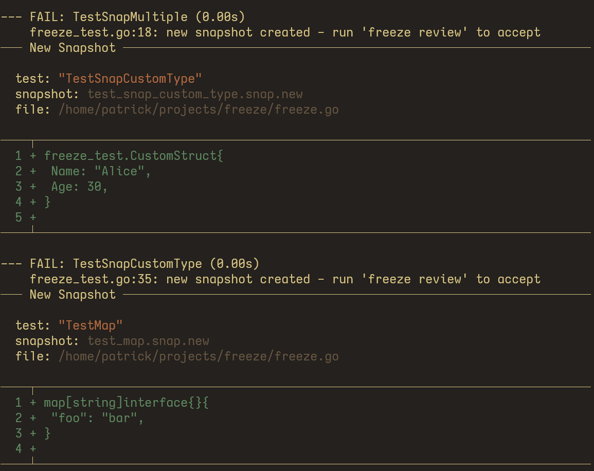

# Freeze

A [birdie](https://github.com/giacomocavalieri/birdie) and [insta](https://github.com/mitsuhiko/insta) inspired snapshot testing library for Go.



## Installation

```sh
go get github.com/ptdewey/freeze
```

## Usage

```go
package yourpackage_test

func TestSomething(t *testing.T) {
    result := SomeFunction("foo")
    freeze.Snap(t, result)

    // To capture the calling function name use SnapFunc
    freeze.SnapFunc(t, SomeFunction("bar"))
}
```

To review a set of snapshots, run:

```sh
go run github.com/ptdewey/freeze/cmd/freeze review
```

## Disclaimer

- This package was largely vibe coded, your mileage may vary (but this library provides more of what I want than the ones below).

## Other Libraries

- [go-snaps](https://github.com/gkampitakis/go-snaps)
- [cupaloy](https://github.com/bradleyjkemp/cupaloy)
